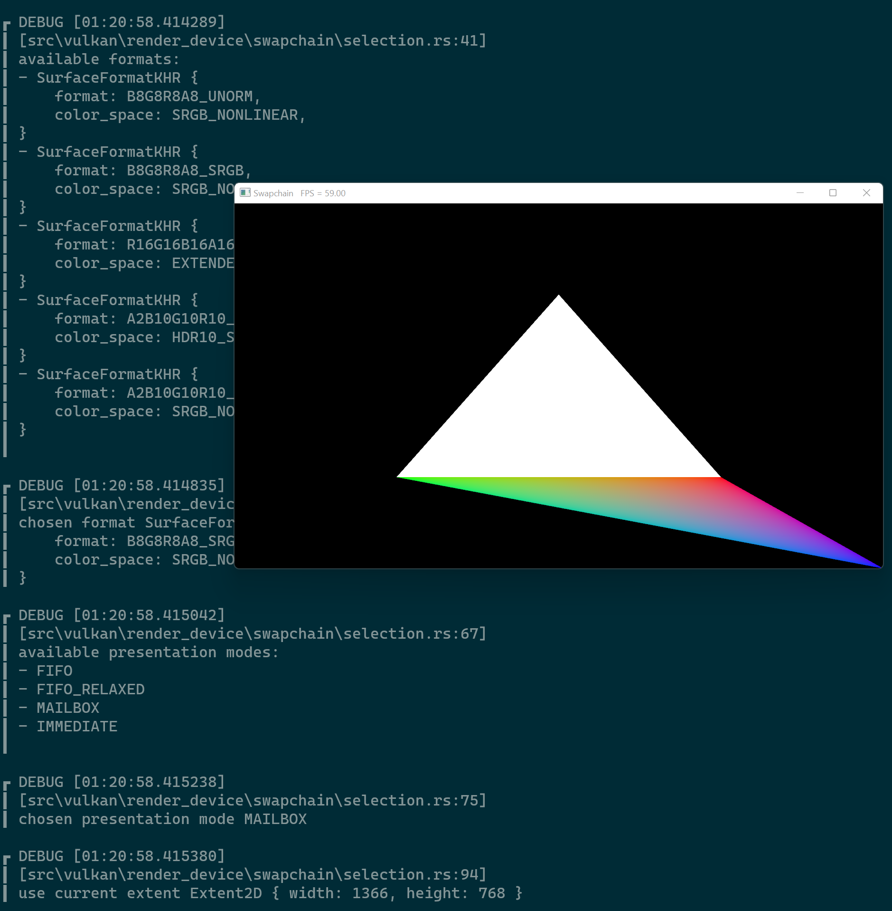

# Hello Segments

This demo lets the user create line-segments and visualize their intersections!

Note: Intersection testing is done brute-force and will become exceptionally
      slow when there are an abundance of segments on the screen.

## Usage

```
cargo run --example e0
```

## Keybinds

* `Esc` - exit
* `Space + Ctrl` - toggle fullscreen

## Screenshot


